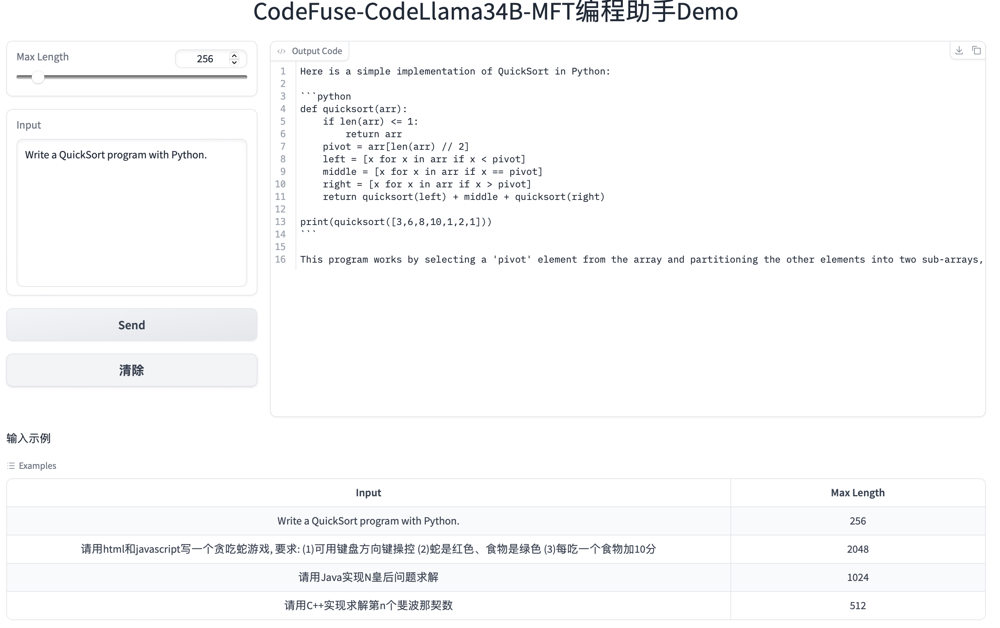

# CodeFuse

  

[**简体中文**](https://github.com/codefuse-ai/.github/blob/main/profile/README_CN.md)|[**HF Repo**](https://huggingface.co/codefuse-ai)|[**ModelScope Repo**](https://modelscope.cn/organization/codefuse-ai)

## About

This repository lists key projects and related demos about CodeFuse. 

## About CodeFuse

CodeFuse aims to develop Code Large Language Models (Code LLMs) to support and enhance full-lifecycle AI native sotware developing, covering crucial stages such as design requirements, coding, testing, building, deployment, operations, and insight analysis. Below is the overall framework of CodeFuse. 

  

 

## List of CodeFuse Projects

We listed projects according to the lifecycle above. 
| Stage                       | Project Repository|  Models   | Datasets   | 
|:----------------------------|:-----------------:|:-------:|:-------:|
| Project Copilot     |    NA      |     NA   |   NA   |
| Code Copilot        |[MFTCoder](https://github.com/codefuse-ai/MFTCoder)      |     NA   |   NA   |
|                     |    NA      |     NA   |   NA   |
|                     |    NA      |     NA   |   NA   |
|                     |    NA      |     NA   |   NA   |
| Test&Build Copilot  |    NA      |     NA   |   NA   |
| Ops Copilot         |    NA      |     NA   |   NA   |
| Data Copilot        |    NA      |     NA   |   NA   |
| Auxilary Modules    |    NA      |     NA   |   NA   |

## Video Demos

*Please note that the English version is under preparation. We appreciate your understanding and patience.*

https://user-images.githubusercontent.com/103973989/267514150-21012a5d-652d-4aea-bcea-582e67855ad7.mp4

## Online Demo

- You can try our CodeFuse-CodeLlama-34B model on ModelScope: [CodeFuse-CodeLlama34B-MFT-Demo](https://modelscope.cn/studios/codefuse-ai/CodeFuse-CodeLlama34B-MFT-Demo/summary)

- You can also try to install the [CodeFuse-Chatbot](https://github.com/codefuse-ai/codefuse-chatbot) to test our models locally. 

## How to get

If you are interested in them, you can download our open-source models from [**HF Repo**](https://huggingface.co/codefuse-ai) or [**ModelScope Repo**](https://modelscope.cn/organization/codefuse-ai). 

Furthermore, you can access our training code in this repository [**MFTCoder**](https://github.com/codefuse-ai/MFTCoder), which enables efficient fine-tuning for multi-task, multi-model, and multi-architecture scenarios.

Additionally, you can access our optimized high-performance inference code in this repository [**FasterTransformer4CodeFuse**](https://github.com/codefuse-ai/FasterTransformer4CodeFuse).
