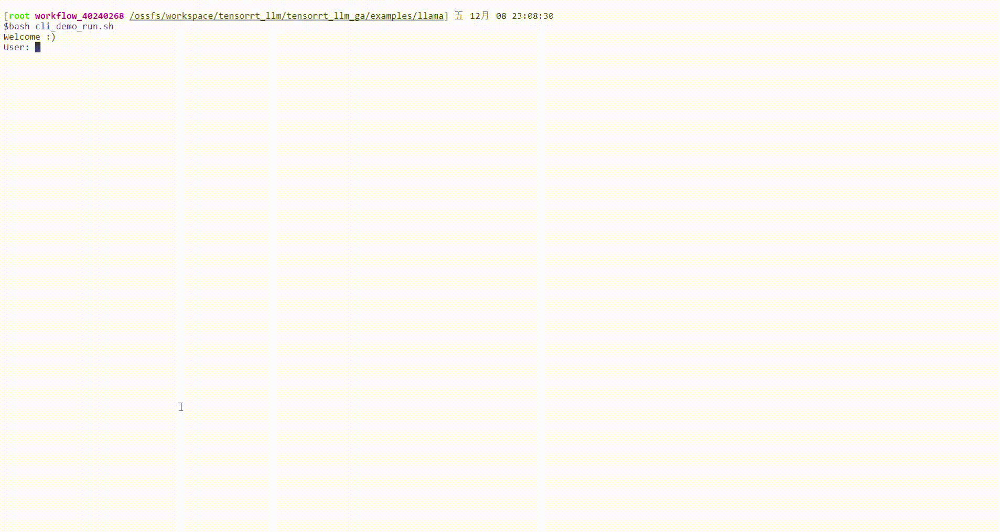

## Cli-demo for CodeFuse-CodeLLaMA-34B-4bits with TensorRT-LLM

### Introduction

This cli-demo aims to show the inference of CodeFuse-CodeLLaMA-34B-4bits utilizing TensorRT-LLM (refer trtllm in the following) engine. We offer the model weights of CodeFuse-CodeLLaMA-34B-4bits and please refer to [TensorRL-LLM ](https://github.com/NVIDIA/TensorRT-LLM/tree/v0.6.1/examples/llama) on github to build trtllm engine. Moreover, our practice is coming soon.


### Usage

The launch script is 
```bash
engine_dir=""
tokenizer_dir=""
python cli_chat.py --engine_dir  "${engine_dir}"  \
                    --tokenizer_dir "${tokenizer_dir}"
```
`enging_dir` and  `tokenizer_dir` are the directory pathes for trtllm engine and tokenizer, respectively. Also, the `max_input_length` and `max_new_tokens`  can be passed to cli_chat.py, and both of them should be less than those corresponding parameters in the trtllm engine config to avoid runtime error.


### Scripts

- demo file [cli_chat.py](cli_chat.py)
- launch script [cli_chat_entry.sh](cli_chat_entry.sh)

### Demonstration



- You can also try to install the [CodeFuse-Chatbot](https://github.com/codefuse-ai/codefuse-chatbot) to test our models locally.
